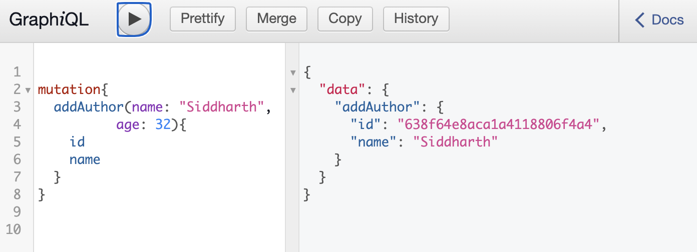
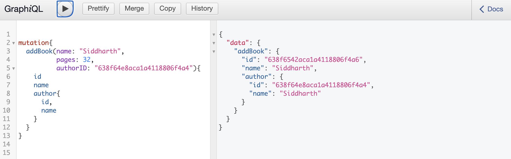

# graphql-nodejs-mongo
Graphql implementation in nodejs with mongo as database

## Key functionalities
- Mutation to add/update data
- Query to get nested data

## How to run

### Webserver
`git clone https://github.com/thekosmix/graphql-nodejs-mongo`

`cd graphql-nodejs-mongo`

`node app.js`

### Querying using GraphiQL
1. Open [GraphiQL](http://localhost:3000/graphql)
2. Type your first query as
```
{
  authors{
    name
    age
  }
}
```
3. Press ▷ button on top left corner

## Screenshots

### Query data


### Add data



